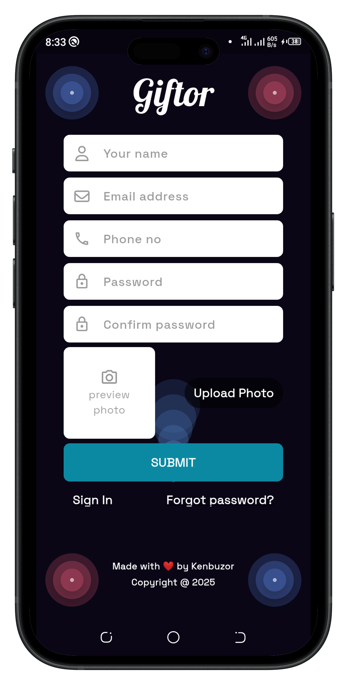
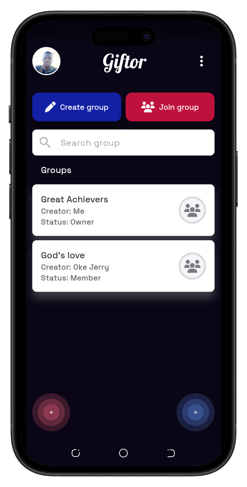
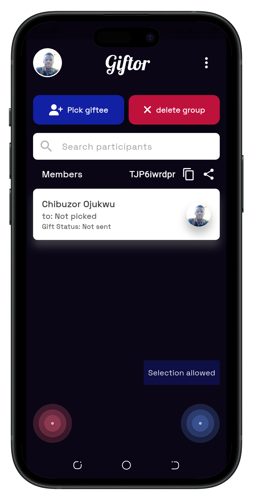
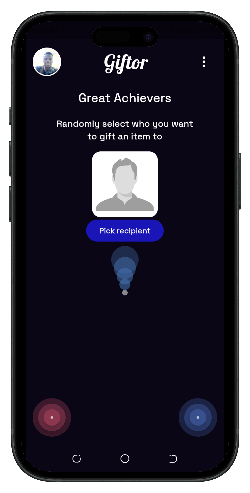
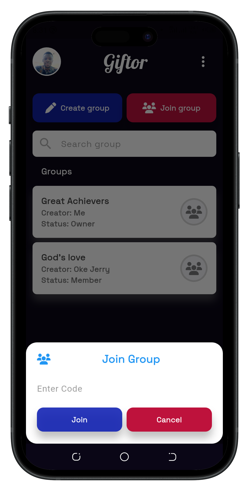

# Giftor

  

A random-picker app

## Screenshots

## Overview

This is a random-picker app. It can be useful for the random selection of who to gift an item to.

In fact, this idea was born from the complexity of sharing gifts among a particular group I was part of in my place of worship. We intended to have everyone write their name in a piece of paper so we can spin and randomly select a secret recipient, but unfortunately we were unable to get everyone to be physically present, so I decided to build an app to help with that.

## Dependencies

- **Font Awesome Flutter** - This plugin provides a great set of shiny and beautiful icons

- **Page Transition** - This plugin provides the ability to smoothly transition between pages or screens

- **rFlutter Alert** - This plugin comes with different pre-built alert dialogs

- **Firebase core** - This plugin enables connecting to multiple firebase apps

- **firebase_auth** - A flutter plugin for firebase auth, enabling authentication using password, Google, Facebook etc.

- **cloud_firestore** - A flutter plugin for cloud firestore, a cloud-hosted, noSQL database with live synchronization and offline support

- **firebase_storage** - A powerful, simple, and cost-effective object storage service for android and iOS

- **freezed_annotation** - Provides annotations for the freezed code-generator. Ensure to have the freezed plugin installed in the dev_dependencies section.

- **image_picker** - A flutter plugin for selecting images from the Android and iOS image library, and taking new pictures with the camera

- **provider** - This plugin is wrapper around inheritedWidget to simplify its usage for managing app-wide state.

- **cached_network_image** - A plugin for loading and caching network images. It can also be used with placeholder and error widgets.

- **shared_preferences** - A plugin for handling data persistence.

- **nanoid** - A plugin for generating unique string id

- **modal_bottom_sheet** - A plugin for creating awesome and powerful modal bottom sheets

- **flutter_native_splash** - Customize Flutter's default white native splash screen with background color and splash image

- **modal_progress_hud_nsn** - A modal progress indicator widget with Sound Null Safety.

- **clipboard** - A flutter package that helps copy text to clipboard and paste from clipboard.

- **share_plus** - Flutter plugin for sharing content via the platform share UI, using the ACTION_SEND intent on Android and UIActivityViewController on iOS

- **image** - Dart Image Library provides server and web apps the ability to load, manipulate, and save images with various image file formats

- **bouncing_widget** - A widget that enables you to add a bouncing animation on a widget

- **google_fonts** - A Flutter package to use fonts from [fonts.google.com](https://fonts.google.com). It supports HTTP fetching, caching, and asset bundling

- **url_launcher** - Flutter plugin for launching a URL. Supports web, phone, SMS, and email schemes

- **intl** - This library provides internationalization and localization. This includes message formatting and replacement, date and number formatting and parsing, and utilities for working with Bidirectional text

## Dev Dependencies

- **build_runner** - This is a build system for dart code generation and modular compilation

- **freezed** - Code generation for immutable classes that has a simple syntax/Api without compromising on features

- **json_serializable** - This is used to automatically generate code for converting to and from JSON by annotating dart classes

**Note** - Dev Dependencies are only needed during development.

## How to install and use via the terminal

1. Open your terminal and navigate to your desired directory where the project should live.

2. Clone the repository using this command `git clone https://github.com/kenbuzor/giftor.git` This command will create a directory called giftor

3. Navigate to the giftor directory `cd giftor`

4. Run the following command to install all necessary dependencies `flutter pub get`

5. Open the project on any code editor of your choice (I use vscode)

6. Ensure to set up a firebase account, create a project (set up the necessary firebase tools e.g firebase auth, cloud firestore, firebase storage), and modify the code to suit your need. [Click here to learn more about firebase](https://firebase.google.com/docs)

7. You can now test the app on an emulator/simulator or on a real device.

   - [How to run a flutter app on android emulator or real android phone](https://docs.flutter.dev/get-started/install/macos/mobile-android)

   - [Test a flutter app on iOS simulator or on a real iPhone](https://docs.flutter.dev/get-started/install/macos/mobile-ios)

## Reference Links

- [Flutter Documentation](https://docs.flutter.dev/)
- [Firebase Documentation](https://firebase.google.com/docs)

## Conclusion

I would advise that you read and tweak the code to your desired need. It will help you learn a lot. Before I forget, I made the UI designs 😎.

Happy Coding 💻
